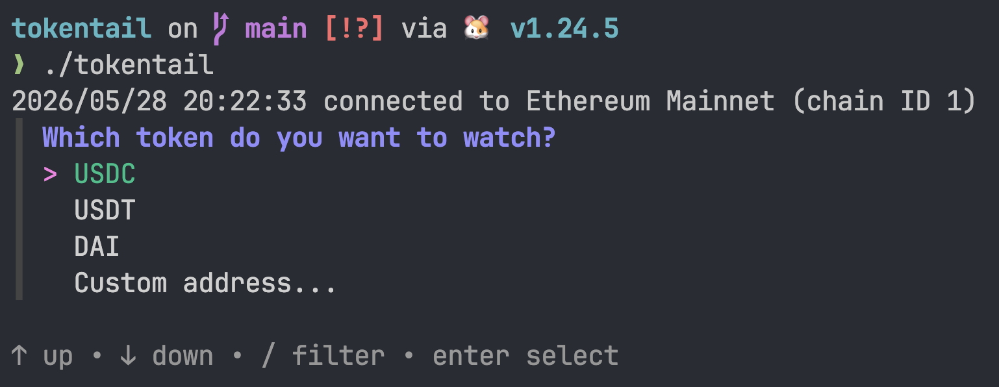

# tokentail

A CLI tool for watching ERC-20 token transfer events on EVM-compatible chains in real time. Connect to any WebSocket RPC endpoint, configure filters interactively, and stream matching transfers to your terminal or export them to CSV or Markdown.



---

## How it works

On startup, tokentail connects to an Ethereum node over WebSocket and uses `eth_subscribe` to receive logs as they are included in new blocks. It filters the raw log stream server-side (by contract address and Transfer topic) and applies client-side filters (amount range, specific address) before writing each matching event to the configured output.

Token decimals and symbols for custom addresses are resolved on-chain via `eth_call` against the ERC-20 `symbol()` and `decimals()` view functions before the subscription starts.

---

## Technologies

| Package                                                          | Role                                                     |
| ---------------------------------------------------------------- | -------------------------------------------------------- |
| [`go-ethereum`](https://github.com/ethereum/go-ethereum) v1.17   | Ethereum client, ABI encoding/decoding, log subscription |
| [`charmbracelet/huh`](https://github.com/charmbracelet/huh) v1.0 | Interactive terminal form for configuration              |
| [`joho/godotenv`](https://github.com/joho/godotenv)              | `.env` file loading                                      |
| Go standard library                                              | `encoding/csv`, `math/big`, `context`, signal handling   |

Requires **Go 1.24+**.

---

## Capabilities

### Token tracking

Predefined quick-select tokens:

| Symbol | Network          | Decimals | Contract                                     |
| ------ | ---------------- | -------- | -------------------------------------------- |
| USDC   | Ethereum Mainnet | 6        | `0xA0b86991c6218b36c1d19D4a2e9Eb0cE3606eB48` |
| USDT   | Ethereum Mainnet | 6        | `0xdAC17F958D2ee523a2206206994597C13D831ec7` |
| DAI    | Ethereum Mainnet | 18       | `0x6B175474E89094C44Da98b954EedeAC495271d0F` |

Any ERC-20 token can be tracked by entering its contract address. The watcher calls `symbol()` and `decimals()` on-chain and resolves the token metadata before starting.

### Network / RPC

Connects to any EVM-compatible chain via WebSocket RPC (`ws://` or `wss://`). HTTP endpoints are not supported — `eth_subscribe` requires a persistent WebSocket connection.

The connected chain is identified on startup:

```
connected to Ethereum Mainnet (chain ID 1)
```

Known chains: Ethereum Mainnet, Optimism, BNB Smart Chain, Polygon, Base, Arbitrum One, Avalanche C-Chain, Sepolia. Unknown chain IDs fall back to displaying the numeric ID.

### RPC URL configuration

The RPC URL is read from `ETH_RPC_URL` in the environment or a `.env` file. If it is not set, the startup form prompts for one interactively.

```bash
# .env
ETH_RPC_URL=wss://eth-mainnet.g.alchemy.com/v2/<API_KEY>
```

A public endpoint with no API key: `wss://ethereum.publicnode.com`

### Amount filtering

Transfers are filtered by human-readable token amount (after decimal conversion):

- **Minimum** — skip transfers below this value (e.g. ignore dust)
- **Maximum** — skip transfers above this value; `0` means no upper limit

Both are set interactively at startup and applied client-side after decoding the raw `uint256` from the log data.

### Address filtering

Optionally restrict output to transfers where a specific address appears as either sender (`from`) or recipient (`to`). This is useful for watching a single wallet or protocol contract.

### Output formats

| Format   | Description                                                           |
| -------- | --------------------------------------------------------------------- |
| Terminal | Formatted multi-line output to stdout                                 |
| CSV      | Appends a row per transfer to a file; writes header on creation       |
| Markdown | Appends a table row per transfer to a file; writes header on creation |

**CSV columns:** `block`, `tx_hash`, `from`, `to`, `amount`, `token`

**Markdown columns:** Block, Transaction Hash, From, To, Amount, Token — addresses and hashes rendered in monospace via backticks.

Output files are created when the watcher starts and flushed and closed on shutdown (Ctrl+C / SIGTERM).

---

## Usage

```bash
# Clone and build
git clone https://github.com/leohhhn/tokentail
cd tokentail

# (Optional) set RPC URL
cp .env.example .env
# edit .env

go run ./cmd/watcher
```

The interactive form walks through:

1. RPC URL (if not set via env)
2. Token to watch (USDC / USDT / DAI / custom address)
3. Amount range (min / max)
4. Address filter (optional)
5. Output format (terminal / CSV / Markdown) and file path

---

## Project structure

```
tokentail/
├── cmd/watcher/
│   └── main.go          # Entry point, interactive form, wiring
├── internal/watcher/
│   ├── watcher.go       # Watcher type, Config, token definitions, chain map
│   ├── resolve.go       # On-chain ERC-20 symbol/decimals resolution
│   └── output.go        # Output writers (stdout, CSV, Markdown)
├── .env.example
└── go.mod
```

---

## Notes for data consumers

- **Amounts** are decoded from the raw ABI-encoded `uint256` in log data and divided by `10^decimals` using arbitrary-precision arithmetic (`math/big`). No floating-point precision is lost during conversion; the final `float64` is only produced at output time.
- **CSV amount** is written with 6 decimal places of precision. Markdown uses 2.
- The subscription starts from the **current block** at launch. Historical data is not fetched.
- Transfers are filtered server-side by contract address and the `Transfer(address,address,uint256)` topic before any client-side filtering is applied, so no bandwidth is wasted on unrelated events.
